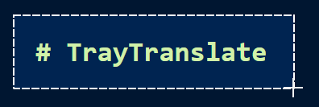

A simple tool that leverages the OpenAI API to translate text on the screen when a shortcut is pressed.

The shortcut in this case is hardcoded as **Shift + Ctrl + PrtScr**. The prompt, however, is customizeable and is in `prompt.md`.

# Setting everything up

If you just want to run it, jump to section *"Running"*.

To use this app, first install Python 3.11, populate the `.env` file with your OpenAI API key. 
Refer to `.env.example` for a reference.

After that, enable the virtual environment and set everything up:

**Windows (PowerShell)**

```powershell
py -3.11 -m venv .venv   # Create the environment if you haven't already  
.venv\Scripts\Activate.ps1   # Activate it
pip install -r .\requirements.txt # Install all requirements
```

You can then either run the app directly:

```powershell
python .\tray_translate_picker.py
```

Or build it into a standalone `.exe` with:

```powershell
pyinstaller --onefile --noconsole .\tray_translate_picker.py
```

# Running

If you download the [prebuilt release](https://github.com/Fusseldieb/traytranslate/releases/) and/or run the standalone executable, make sure to have the `.env` **in the same directory**.